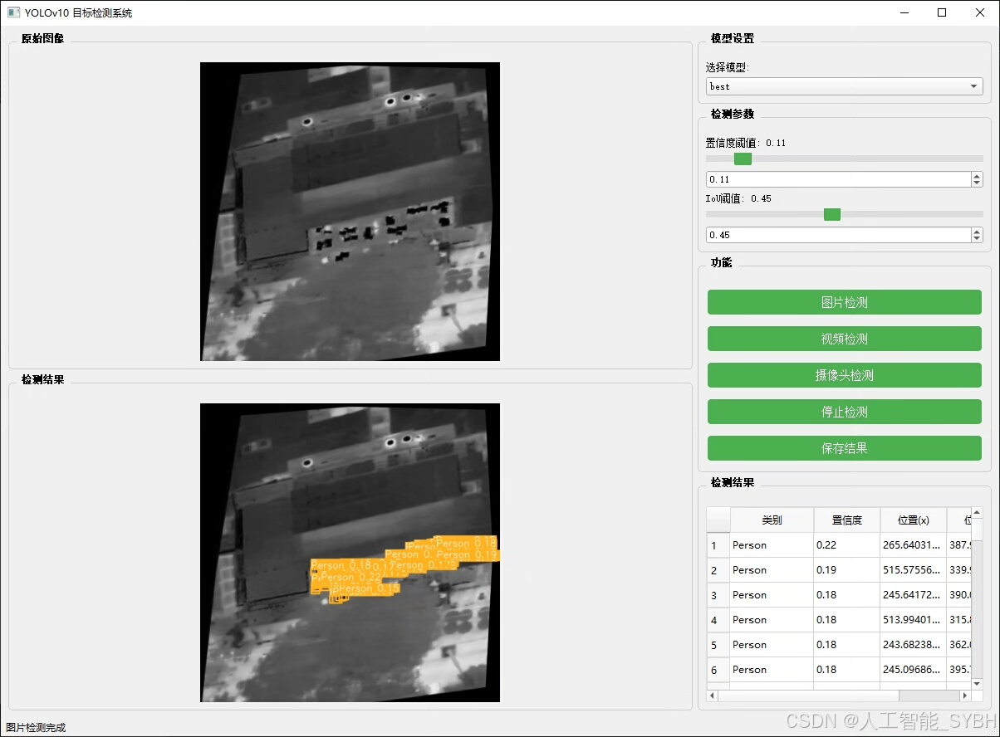
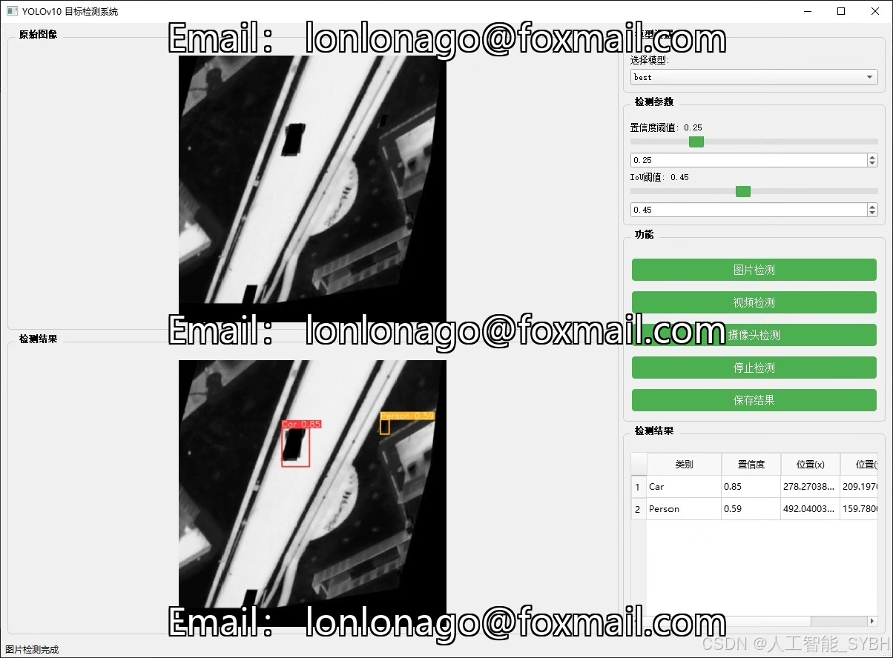
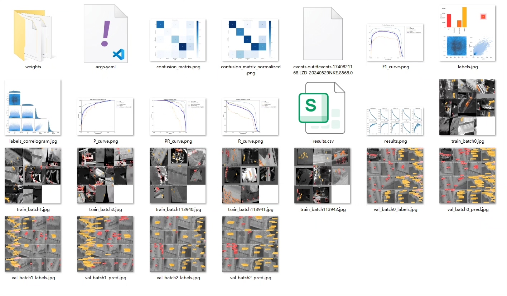
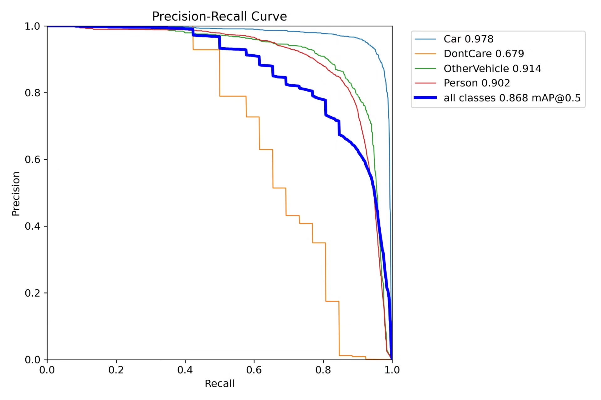
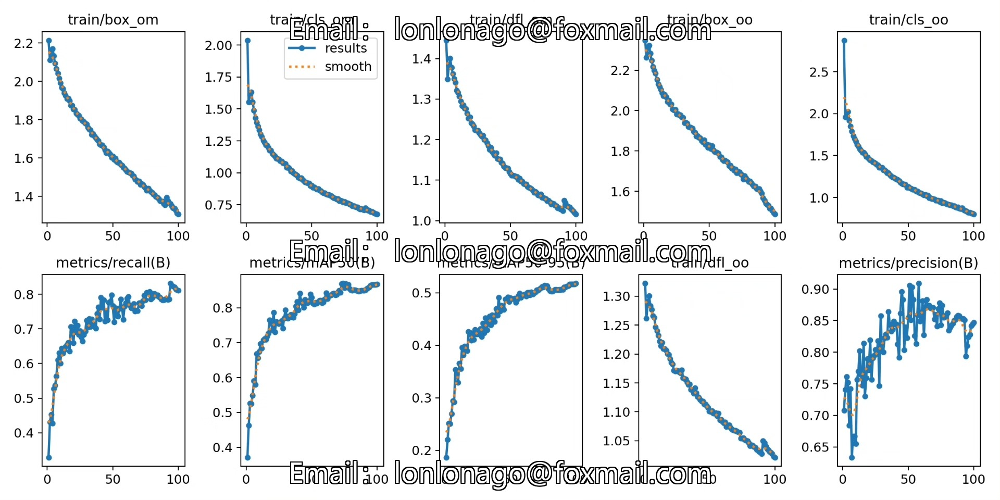
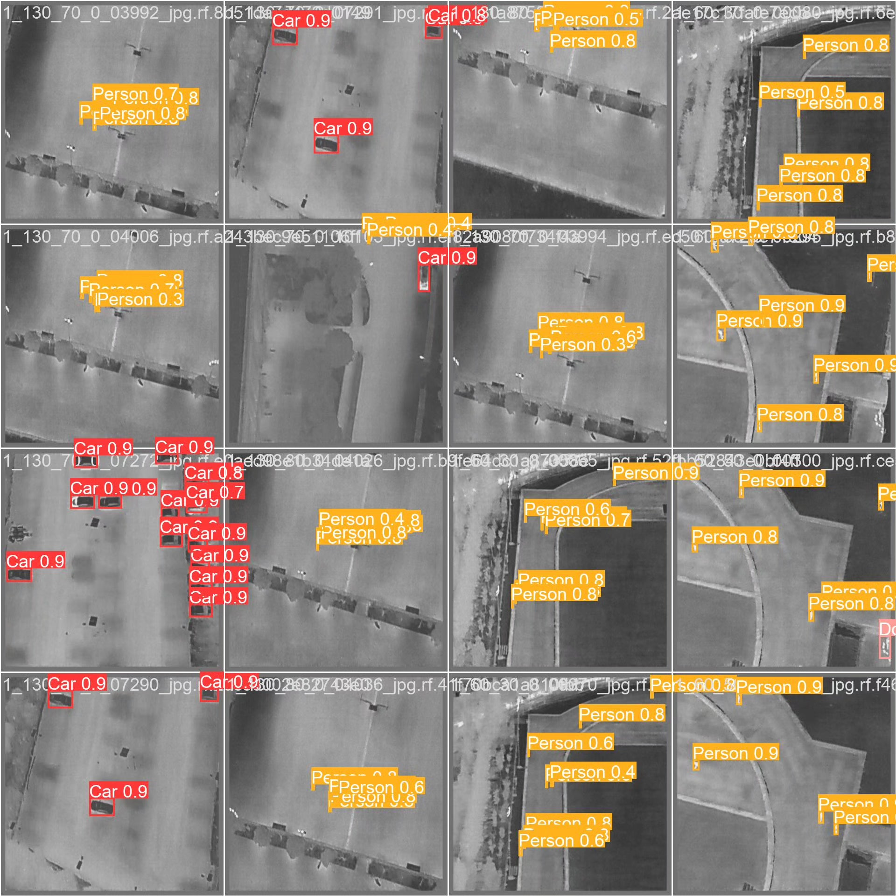
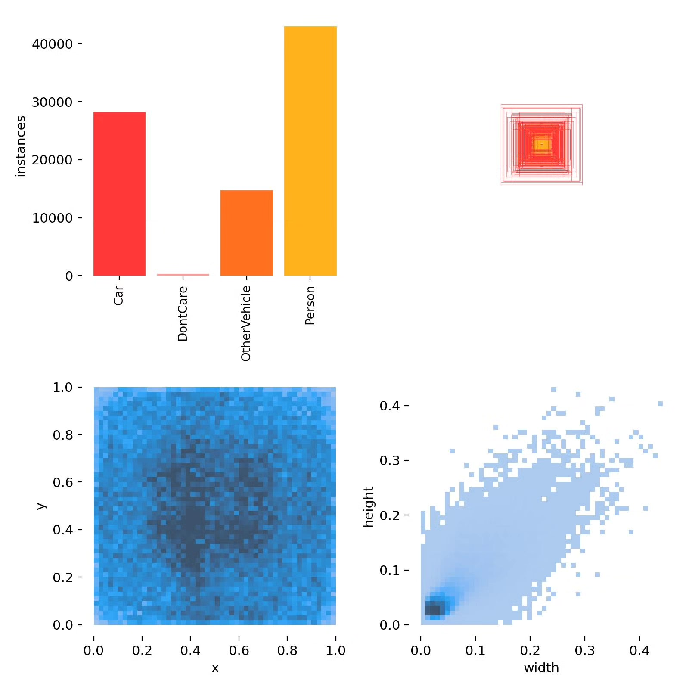
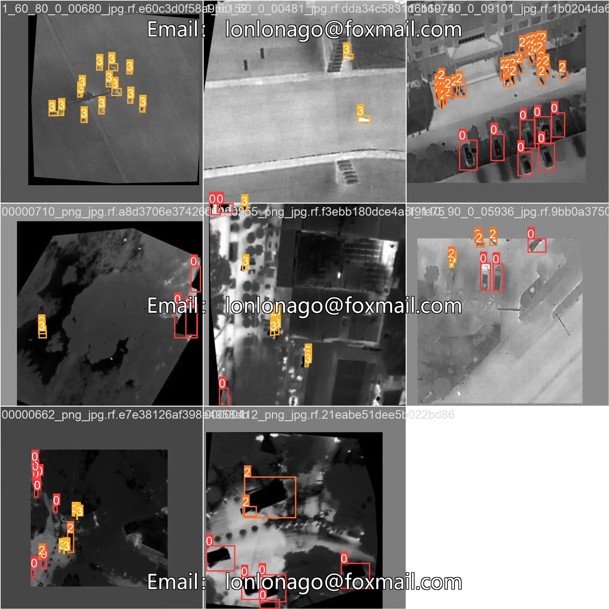

# UAV Infrared Detection System Based on Deep Learning YOLOv10 (Vehicle and Pedestrian Detection)

## Body

Based on the latest version of YOLOv10, a drone infrared detection system (vehicle and pedestrian detection) is developed. YOLOv10, as the latest version of the YOLO series, has become an ideal choice for drone infrared detection systems due to its high efficiency and accuracy. The project aims to utilize the YOLOv10 algorithm combined with infrared image data to develop a highly efficient and accurate vehicle and pedestrian detection system, providing intelligent support for drone applications.

The company's products have obtained the official commercial license certification from YOLO.

We provide after-sales service.

After payment, we will provide WeChat IDs for instant questions and answers.

Environmental configuration: We will provide a tutorial on environmental configuration, and WeChat will provide Q&A.

Remote installation services: If you need remote configuration, an additional fee of 69 is required. If the configuration fails, all fees will be refunded (specially for old computers only refunding installation fees).

Retraining dataset: After setting up the environment, you can train on your own computer. If you need us to retrain, just pay 69 plus computing power fees (2.5 yuan/hour).

Full after-sales service

## Images

## Payment

Here is a pay link on Stripe ( https://buy.stripe.com/3cs8yP7sY87d0vu9AB ). Please contact me lonlonago@foxmail.com after funding $89, and I will send you a complete data files , thank you!

